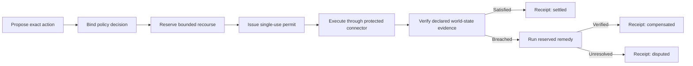

# Consequence Rail

Recourse-gated execution and settlement receipts for autonomous actions.

Authorization can establish that a system may act. Logs can record what it
attempted. Neither establishes that a usable remedy exists before the action,
or that the resulting world state was later verified.

Consequence Rail admits an executable action only after a bounded remedy has
been reserved for that exact action. It then verifies the configured
postcondition and closes the action with a signed technical outcome:
`settled`, `compensated`, or `disputed`.

> Experimental v0.1 reference implementation. It does not provide insurance,
> legal compliance, guaranteed recovery, or proof that an evidence source is
> truthful.

## Two invariants

1. **No verifiable recourse reservation, no enforced execution.**
2. **No verified world-state outcome, no settlement receipt.**

## Try the failure path first

Requirements: Node.js 20 or newer. The project has no third-party runtime
dependencies.

```text
node ./cmd/crctl.js demo refund --fault duplicate
```

Expected result:

```text
scenario: synthetic-refund
fault: duplicate
assurance: enforced
state: CLOSED
outcome: compensated
execution_calls: 1
remedy_calls: 1
active_refunds: 1
bundle_verification: pass
```

The connector created two synthetic refunds. The rail detected the failed
postcondition, invoked the pre-reserved `void-duplicate-refund` remedy, checked
the world state again, and issued a signed `compensated` receipt.

The normal path is:

```text
node ./cmd/crctl.js demo refund
```

The refusal path is:

```text
node ./cmd/crctl.js demo irreversible
```

The email example is authorized by policy but refused because the connector
cannot honestly reserve a bounded undo capability.

Run the complete deterministic suite:

```text
node --test
```

## What the reference implementation provides

- Five versioned protocol artifacts: `ActionProposal`,
  `RecourseReservation`, `ActionPermit`, `OutcomeEvidence`, and
  `SettlementReceipt`.
- Connector-signed recourse commitments with reservation status and release
  semantics.
- Exact action binding through deterministic JSON digests.
- Signed, expiring, single-use execution permits.
- Explicit `enforced`, `cooperative`, and `observed` assurance modes.
- An event-sourced lifecycle with `UNKNOWN`, `INCONCLUSIVE`, and
  `REVIEW_REQUIRED` states.
- Status reconciliation after ambiguous network outcomes, with no blind retry.
- Independent remedy-status reconciliation after ambiguous remediation.
- Data-only postconditions using a small operator allowlist.
- A synthetic refund connector with deterministic fault injection.
- Signed event chains and offline bundle verification against an explicitly
  trusted key.
- An OpenAPI 3.1 reference surface and JSON Schemas.

## How it is used

The rail sits between an autonomous proposer and a side-effecting connector.
In `enforced` mode, the rail must exclusively control the downstream
credential. It rechecks connector recourse immediately before consuming the
permit and invoking the connector.



Start the local sidecar:

```text
node ./cmd/rail.js
```

Its default address is `http://127.0.0.1:8787`. Read
[`api/openapi.json`](api/openapi.json) for the request surface. The v0.1
sidecar stores state in memory and exposes only the synthetic connector.

## Assurance modes

| Mode | Meaning | May issue a permit |
| --- | --- | --- |
| `enforced` | Only the rail holds the downstream credential | Yes |
| `cooperative` | The application consults the rail, but another path may bypass it | Yes, with `bypass_possible: true` |
| `observed` | The rail records or inspects activity without controlling execution | No |

An integration must not claim prevention unless it satisfies the `enforced`
credential boundary.

## Bundle profiles and verification

The default `receipt` profile contains digests, signed artifacts and the event
chain, but omits the full proposal and raw outcome evidence. It supports
integrity verification without disclosing audit facts.

The `audit` profile includes the synthetic proposal and evidence. Full
verification then:

- verifies the rail and connector signatures against separately trusted keys
- replays every state transition
- validates action, permit, reservation and commitment bindings
- checks evidence source, resource, freshness and postcondition evaluation
- derives the outcome from the signed lifecycle
- rejects a receipt whose outcome contradicts its evidence or state history

The CLI demo uses the `audit` profile. An embedded key is never trusted
automatically.

The conformance suite checks runtime presence of schema-required fields. It
does not claim complete JSON Schema validation; that remains a cross-language
conformance task.

A remote connector can still change reservation state between the final
status check and execution. A production connector therefore needs an atomic
lease-consume or execute-with-reservation operation. The in-process mock makes
that boundary atomic only for this demonstration.

## Deterministic fault matrix

```text
node ./cmd/crctl.js demo refund --fault duplicate
node ./cmd/crctl.js demo refund --fault lost-response-after-commit
node ./cmd/crctl.js demo refund --fault lost-response-before-commit
node ./cmd/crctl.js demo refund --fault stale-evidence
node ./cmd/crctl.js demo refund --fault remedy-failure
node ./cmd/crctl.js demo refund --fault remedy-lost-response-after-commit
node ./cmd/crctl.js demo refund --fault remedy-lost-response-before-commit
node ./cmd/crctl.js demo refund --fault post-remedy-stale-evidence
node ./cmd/crctl.js demo refund --fault post-remedy-false-evidence
node ./cmd/crctl.js demo refund --fault permit-replay
node ./cmd/crctl.js demo refund --fault action-mutation
node ./cmd/crctl.js demo refund --fault tampered-bundle
```

All inputs, account references, order references, money values, keys, and
connector responses are synthetic.

## What makes the boundary useful

Consequence Rail is not a policy engine, identity system, generic API gateway,
workflow orchestrator, telemetry platform, or blockchain. It is intended to
consume decisions and evidence from those systems.

Its narrow contribution is the complete technical chain:

1. Bind one exact action.
2. Reserve a bounded remedy before execution.
3. Issue and atomically consume a single-use permit.
4. Verify the configured postcondition against a declared evidence source.
5. Invoke and verify the reserved remedy when needed.
6. Produce a portable technical settlement receipt.

## Security and limits

The demo rail and connector signing keys are deterministically derived from
public labels and are not secret. They must never be used for production
trust.

Signatures establish integrity and provenance under a trusted key. They do not
establish that evidence is true, complete, independent, or causally connected
to an action. Hash chains detect mutation only while a trustworthy checkpoint
or chain head remains outside an attacker's control.

Only a pre-authorized, bounded, reversible remedy may run automatically. An
unanticipated or irreversible response must become a new consequential
action.

Read:

- [Threat model](docs/threat-model.md)
- [Privacy model](docs/privacy.md)
- [Assurance modes](docs/assurance-modes.md)
- [Non-goals](docs/non-goals.md)

## Repository map

- [`spec/model.md`](spec/model.md): artifact and digest model
- [`spec/state-machine.md`](spec/state-machine.md): normative lifecycle
- [`spec/schemas/`](spec/schemas/): JSON Schemas
- [`api/openapi.json`](api/openapi.json): OpenAPI 3.1 surface
- [`src/`](src/): reference rail, signing, connector, and verifier
- [`cmd/`](cmd/): sidecar and CLI entry points
- [`conformance/`](conformance/): synthetic portable fixtures
- [`test/`](test/): deterministic behavior and fault tests
- [`docs/architecture.md`](docs/architecture.md): components and trust boundaries
- [`SECURITY.md`](SECURITY.md): vulnerability reporting guidance
- [`CONTRIBUTING.md`](CONTRIBUTING.md): contribution rules

## Project status

This is an experimental reference implementation, not a production release.
The publication controls and release gates are recorded in
[`docs/publication-plan.md`](docs/publication-plan.md).

Licensed under the [Apache License 2.0](LICENSE).

Public identity: Oonyl.
