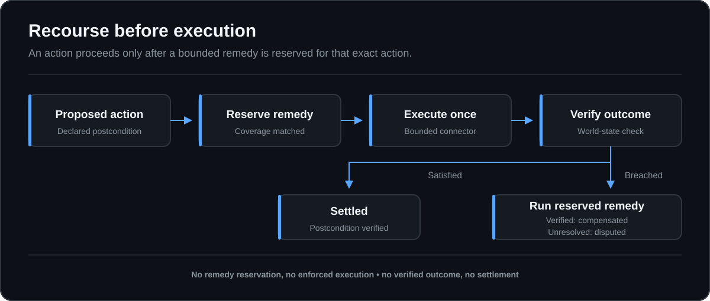
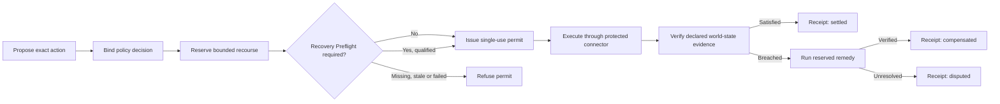

# Consequence Rail

Recourse-gated execution and settlement receipts for autonomous actions.

Authorization can establish that a system may act. Logs can record what it
attempted. Neither establishes that a usable remedy exists before the action,
or that the resulting world state was later verified.

Consequence Rail admits an executable action only after a bounded remedy has
been reserved for that exact action. It then verifies the configured
postcondition and closes the action with a signed technical outcome:
`settled`, `compensated`, or `disputed`.

> Experimental v0.2 reference implementation. It does not provide insurance,
> legal compliance, guaranteed recovery, or proof that an evidence source is
> truthful.



## Two invariants

1. **No verifiable recourse reservation, no enforced execution.**
2. **No verified world-state outcome, no settlement receipt.**

When an authorization decision enables Recovery Preflight, a third gate
applies: **no current, trusted, coverage-matched recovery drill, no permit.**

## Try the failure path first

Requirements: Node.js 20 or newer. The project has no third-party runtime
dependencies.

```text
node ./cmd/crctl.js --help
node ./cmd/crctl.js demo refund --fault duplicate
```

Expected result:

```text
scenario: synthetic-refund
fault: duplicate
assurance: enforced
state: CLOSED
outcome: compensated
execution_calls: 1
remedy_calls: 1
active_refunds: 1
bundle_verification: pass
```

The connector created two synthetic refunds. The rail detected the failed
postcondition, invoked the pre-reserved `void-duplicate-refund` remedy, checked
the world state again, and issued a signed `compensated` receipt.

The normal path is:

```text
node ./cmd/crctl.js demo refund
```

The refusal path is:

```text
node ./cmd/crctl.js demo irreversible
```

The email example is authorized by policy but refused because the connector
cannot honestly reserve a bounded undo capability.

Run the complete deterministic suite:

```text
node --test
```

## Recovery Preflight

A reservation proves that a connector has declared and reserved a remedy. It
does not prove that the remedy implementation currently restores the declared
state. Recovery Preflight closes that narrower evidence gap before permit
issuance when a policy requires it.

Run the synthetic drill:

```text
node ./cmd/crctl.js demo recovery-preflight
```

Expected result:

```text
scenario: synthetic-refund-recovery-preflight
fault: none
fixture_fidelity: synthetic
recovery_class: exact
qualification: QUALIFIED_EXACT
bundle_verification: pass
permit_without_preflight: refused
permit_after_preflight: issued
live_connector_execute_calls: 0
live_connector_remedy_calls: 0
production_recovery_claimed: false
```

The drill creates fresh isolated refund connectors, establishes the clean
declared evidence state, injects the duplicate-refund fault, invokes the same
reserved remedy implementation used by the Rail, and compares the recovered
state with the pinned oracle. It emits a separately signed and replayable
`RecoveryDrillBundle`. It never exercises the live action connector.

Negative controls are explicit:

```text
node ./cmd/crctl.js demo recovery-preflight --fault missing-checkpoint
node ./cmd/crctl.js demo recovery-preflight --fault corrupt-checkpoint
node ./cmd/crctl.js demo recovery-preflight --fault fault-not-observed
node ./cmd/crctl.js demo recovery-preflight --fault remedy-failure
node ./cmd/crctl.js demo recovery-preflight --fault not-testable-local
node ./cmd/crctl.js demo recovery-preflight --fault out-of-scope
```

Offline `recovery-preflight verify` checks signatures and replay bindings. It
reports freshness as `not_checked` unless a caller supplies a verification
time through the library API. The Rail always supplies its clock and requires
the attestation to be current.

Settlement bundles can be verified and rendered as a metadata-only event
timeline without network access:

```text
node ./cmd/crctl.js bundle timeline settlement-bundle.json
node ./cmd/crctl.js bundle timeline settlement-bundle.json --json
```

The command performs the existing integrity checks first, and applies the
existing lifecycle-semantic checks when the bundle has the audit profile. It
then emits event types, timestamps, state transitions, and payload digests. It
does not include raw outcome evidence.

`QUALIFIED_EXACT` means exact only for the complete pinned action digest and
within its declared envelope,
exact signed reservation, capability reference, connector commitment,
measured recovery callables, precommitted checkpoint, and the registered
fixture adapter's live `run` callable captured immediately before invocation,
plus the fault, procedure, and declared evidence surface. These bindings are checked when the
drill is accepted and again before permit, execution, and remediation. The
current runner refuses to invoke an adapter for
staging or production-like fixtures; those labels produce
`NOT_TESTABLE_LOCAL` without a recovery attempt.
`REVIEW_COMPENSATED` is not accepted automatically by the reference Rail.

## What the reference implementation provides

- Five versioned protocol artifacts: `ActionProposal`,
  `RecourseReservation`, `ActionPermit`, `OutcomeEvidence`, and
  `SettlementReceipt`.
- Connector-signed recourse commitments with reservation status and release
  semantics.
- Exact action binding through deterministic JSON digests.
- Signed, expiring, single-use execution permits.
- Explicit `enforced`, `cooperative`, and `observed` assurance modes.
- An event-sourced lifecycle with `UNKNOWN`, `INCONCLUSIVE`, and
  `REVIEW_REQUIRED` states.
- Status reconciliation after ambiguous network outcomes, with no blind retry.
- Independent remedy-status reconciliation after ambiguous remediation.
- Data-only postconditions using a small operator allowlist.
- A synthetic refund connector with deterministic fault injection.
- Signed event chains and offline bundle verification against an explicitly
  trusted key.
- Recovery contracts, signed drill attestations, deterministic replay, and an
  optional permit gate with a separately trusted recovery key.
- An OpenAPI 3.1 reference surface and JSON Schemas.

## How it is used

The rail sits between an autonomous proposer and a side-effecting connector.
In `enforced` mode, the rail must exclusively control the downstream
credential. It rechecks connector recourse immediately before consuming the
permit and invoking the connector.



Start the local sidecar:

```text
node ./cmd/rail.js --help
node ./cmd/rail.js
```

Its default address is `http://127.0.0.1:8787`. It uses the host clock so
OpenAPI clients can send current timestamps. Pass `--clock demo` to freeze
time at the conformance epoch `2035-01-01T00:00:00.000Z`. When flags are
omitted, `CONSEQUENCE_RAIL_PORT` and `CONSEQUENCE_RAIL_CLOCK` supply the same
defaults. Read [`api/openapi.json`](api/openapi.json) for the request surface.
The sidecar accepts the immutable ActionProposal v0.1 format and the opt-in
v0.2 format for schema-bounded numeric `gte` and `lte` clauses. A v0.2
proposal exports a v0.2 settlement bundle and a signed v0.2 receipt that binds
the proposal schema version even in the proposal-free receipt profile. Default
v0.1 demo artifacts remain unchanged.
The v0.1 sidecar stores bounded state in memory and exposes only the synthetic
connector. It accepts only loopback clients and same-origin loopback Host and
Origin values, caps JSON bodies at 65,536 bytes, restricts content types and
encodings, bounds headers, request time, concurrency, and requests per socket,
and emits restrictive response headers. It is still not an authenticated or
production deployment boundary.

## Assurance modes

| Mode | Meaning | May issue a permit |
| --- | --- | --- |
| `enforced` | Only the rail holds the downstream credential | Yes |
| `cooperative` | The application consults the rail, but another path may bypass it | Yes, with `bypass_possible: true` |
| `observed` | The rail records or inspects activity without controlling execution | No |

An integration must not claim prevention unless it satisfies the `enforced`
credential boundary.

## Bundle profiles and verification

The default `receipt` profile contains digests, signed artifacts and the event
chain, but omits the full proposal and raw outcome evidence. It supports
integrity verification without disclosing audit facts.

The `audit` profile includes the synthetic proposal and evidence. Full
verification then:

- verifies the rail and connector signatures against separately trusted keys
- replays every state transition
- validates action, permit, reservation and commitment bindings
- checks evidence source, resource, freshness and postcondition evaluation
- derives the outcome from the signed lifecycle
- rejects a receipt whose outcome contradicts its evidence or state history

The CLI demo uses the `audit` profile. An embedded key is never trusted
automatically.

The conformance suite checks runtime presence of schema-required fields. It
also requires every object schema to declare whether additional properties are
allowed. It does not claim complete cross-language JSON Schema validation.

A remote connector can still change reservation state between the final
status check and execution. A production connector therefore needs an atomic
lease-consume or execute-with-reservation operation. The in-process mock makes
that boundary atomic only for this demonstration.

## Deterministic fault matrix

```text
node ./cmd/crctl.js demo refund --fault duplicate
node ./cmd/crctl.js demo refund --fault lost-response-after-commit
node ./cmd/crctl.js demo refund --fault lost-response-before-commit
node ./cmd/crctl.js demo refund --fault stale-evidence
node ./cmd/crctl.js demo refund --fault remedy-failure
node ./cmd/crctl.js demo refund --fault remedy-lost-response-after-commit
node ./cmd/crctl.js demo refund --fault remedy-lost-response-before-commit
node ./cmd/crctl.js demo refund --fault post-remedy-stale-evidence
node ./cmd/crctl.js demo refund --fault post-remedy-false-evidence
node ./cmd/crctl.js demo refund --fault permit-replay
node ./cmd/crctl.js demo refund --fault action-mutation
node ./cmd/crctl.js demo refund --fault tampered-bundle
```

All inputs, account references, order references, money values, keys, and
connector responses are synthetic.

## What makes the boundary useful

Consequence Rail is not a policy engine, identity system, generic API gateway,
workflow orchestrator, telemetry platform, or blockchain. It is intended to
consume decisions and evidence from those systems.

Its narrow contribution is the complete technical chain:

1. Bind one exact action.
2. Reserve a bounded remedy before execution.
3. Issue and atomically consume a single-use permit.
4. Verify the configured postcondition against a declared evidence source.
5. Invoke and verify the reserved remedy when needed.
6. Produce a portable technical settlement receipt.

Recovery Preflight is an optional admission profile around step 3. It does
not add a second permit system, execute remediation in the live action path,
or change settlement semantics.

## Security and limits

The demo rail and connector signing keys are deterministically derived from
public labels and are not secret. They must never be used for production
trust.

Signatures establish integrity and provenance under a trusted key. They do not
establish that evidence is true, complete, independent, or causally connected
to an action. Hash chains detect mutation only while a trustworthy checkpoint
or chain head remains outside an attacker's control.

Only a pre-authorized, bounded, reversible remedy may run automatically. An
unanticipated or irreversible response must become a new consequential
action.

Recovery drill signatures prove artifact integrity and signer provenance.
They do not prove fixture fidelity, production availability, legal remedy,
insurance coverage, or reversibility of already-sent messages and other
irreversible external effects.

The verifier rejects undeclared fields across every closed settlement-bundle
object before signature and lifecycle checks. The loopback sidecar likewise
rejects unknown or repeated query parameters before reading a mutating request
body. A process-wide Recovery Preflight requirement is monotonic: an individual
authorization may strengthen it but cannot turn it off.

Read:

- [Threat model](docs/threat-model.md)
- [Privacy model](docs/privacy.md)
- [Assurance modes](docs/assurance-modes.md)
- [Non-goals](docs/non-goals.md)

## Repository map

- [`spec/model.md`](spec/model.md): artifact and digest model
- [`spec/state-machine.md`](spec/state-machine.md): normative lifecycle
- [`spec/schemas/`](spec/schemas/): JSON Schemas
- [`api/openapi.json`](api/openapi.json): OpenAPI 3.1 surface
- [`src/`](src/): reference rail, signing, connector, and verifier
- [`src/recovery-preflight.js`](src/recovery-preflight.js): recovery contract,
  qualification and replay verification
- [`src/mock-refund-recovery-adapter.js`](src/mock-refund-recovery-adapter.js):
  isolated synthetic drill adapter
- [`cmd/`](cmd/): sidecar and CLI entry points
- [`conformance/`](conformance/): synthetic portable fixtures
- [`test/`](test/): deterministic behavior and fault tests
- [`docs/architecture.md`](docs/architecture.md): components and trust boundaries
- [`SECURITY.md`](SECURITY.md): vulnerability reporting guidance
- [`CONTRIBUTING.md`](CONTRIBUTING.md): contribution rules

## Project status

This checkout contains the experimental v0.2.0 source release. It is a
reference implementation, not a production deployment or hosted service.
The public release status and maintenance boundaries are recorded in
[`docs/release-status.md`](docs/release-status.md).

Licensed under the [Apache License 2.0](LICENSE).

Public identity: EauDoon.
